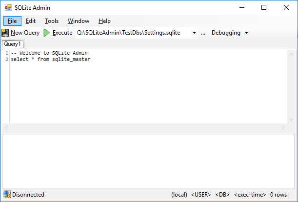

# SQLite Admin
Copyright 2017-2019 (C) Xeno Innovations, Inc.

_**WARNING:** pre-alpha prototype in progress!_

SQLite Admin is a lightweight management studio for SQLite databases, powered by .NET.

The long-term goal is to be able to manage a  DB's _tables, edit views, merge DBs, encrypt (ADO.NET), etc._ . This is a complete rework of XI's internal project started back on 2011-06-17.

### Project Status
Currently a work in progress to provide a simple SQLite management studio.

## Milestones

### 1: Basic editor
Single database instance SQL syntax editor with executions. Start with SQLite engine, System.Data.Sqlite.

### 2: Object Explorer
Simple DB object explorer to display: tables, views, etc.

### 3: Solutions
Save project as solutions to be more IDE like.

### Ungroomed Features
* **Multi-DB Management** - Ability to manage multiple database connections in a single project
* **Selectable Engines** - Ability to choose which SQLite engine to execute from
* **Multi-platform** - Rework core system to be Mono compliant and run on multiple platforms.

## Source Code
The main project resides in the ``src`` folder.

Great admin tools come with great editors, which is why we're using [AvalonEdit](https://github.com/icsharpcode/AvalonEdit). The current hurdle is that this framework (_using WinForms_) is not easily testable which is why I'd like to move to an MVVM approach written in C#.  Since AvalonEdit is written using WPF, this may be our natural progression.

### Main Code and Test Benches

* ``src`` - Main project written in WinForms (_soon to be deprecated_)
* ``test-ava`` - Test bench for multi-platform codebase written in Avalonia
* ``test-wpf`` - Test bench written in WPF

### Syntax Highlighting
Our current editor is [AvalonEdit](https://github.com/icsharpcode/AvalonEdit).

Other editors considered:

| Editor | Framework | Notes |
|:-------|:----------|:------|
| [ScintillaNET](https://github.com/jacobslusser/ScintillaNET) | WinForms |  |
| [RoslynPad](https://roslynpad.net/) [GitHub](https://github.com/aelij/RoslynPad) | WPF | _Port of AvalonEdit_ |
| [AvaloniaEdit](https://github.com/AvaloniaUI/AvaloniaEdit) | Avalonia | _Port of AvalonEdit_ |
